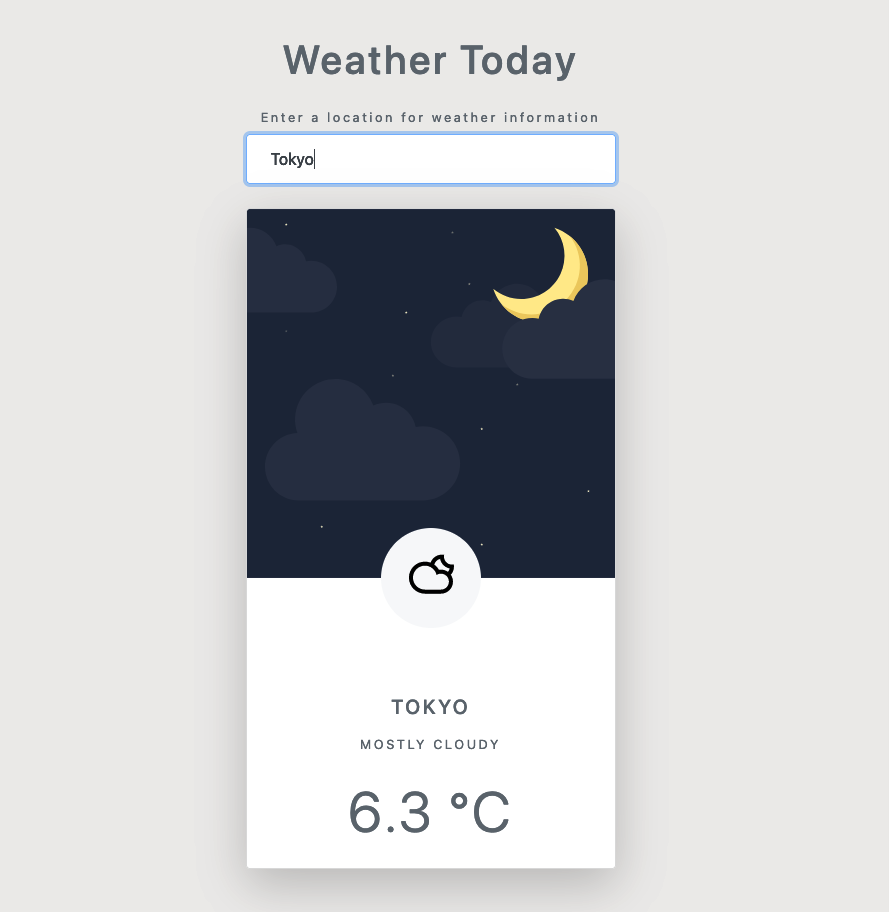

# Weather-app
This is a weather app that uses the AccuWeather API to retrieve weather information for a given city. It was created as part of the Udemy course "Modern JavaScript from Novice to Ninja" by Net Ninja (https://www.udemy.com/course/modern-javascript-from-novice-to-ninja/).

## Screenshot

## Deployment
App is deployed on GitHub Pages: https://aloosli.github.io/weather-app/

## Features
Retrieve current weather information (temperature, weather text, weather icon) for a given city
Day/Night switch based on time of day
Remembers the last city searched using local storage
## Usage
Enter a city in the input field and hit submit. The app will retrieve the weather information for the city and display it on the page.

## Technologies
JavaScript (ES6)
HTML
CSS
AccuWeather API
Code Highlights
Async/await for API calls
Fetch API for making HTTP requests
Template literals for dynamic UI updates
Local storage for storing the last city searched.